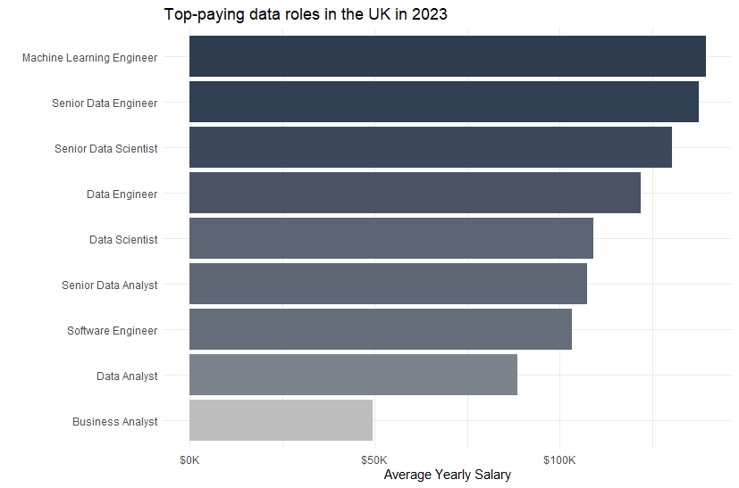

# Data Jobs in the UK – Final Project for SQL for Data Analytics Course

This is the README file to give you an overview of the project.
## Introduction
Do you want to know more about the job market for data professionals globally and in the UK in 2023? This project explores 📊 the most frequently posted jobs and 💰 associated salaries for data professionals, as well as delving into the details of the 📈 Data Scientist role and 🔥 in-demand skills needed to succeed in the market. At the same time, this project showcases 💻 my SQL coding skills and 📢 my ability to clearly communicate the findings. 

SQL queries are available in the project’s [sql_queries](/sql_queries/) folder, and the R script to visualise key findings is in the [r_code](/r_code/) folder.

# Background
The motivation behind this project comes from my desire to better understand market trends for the Data Scientist role in the UK. I aimed to discover which skills are the most in demand and to identify patterns in the data job market, making potential job searches more targeted and effective. The data for this analysis came from **Luke Barousse’s** [SQL Course](https://lukebarousse.com/sql). This data includes details on job titles, salaries, locations, and required skills. Data was collected in 2023 and is available to explore via the [Data.Nerd App](https://datanerd.tech).

The questions I aimed to answer through my SQL queries were:

[1. The most in demand roles in the UK market.](#1-the-most-in-demand-roles-in-the-uk-market)

[2. The top-paying roles based on average yearly salary in the UK.](#2-the-top-paying-roles-based-on-average-yearly-salary-in-the-uk)

[3. Top paid job titles for Data Scientist role in the UK. ](#3-top-paid-job-titles-for-data-scientist-role-in-the-uk)

[4. 10 most in demand skills for Data Scientist in the UK.](#4-10-most-in-demand-skills-for-data-scientist-in-the-uk)

[5. Top paid skills for Data Scientist in the UK](#5-what-are-the-top-skills-needed-for-data-scientist-based-on-salary)

[6. Part-time offerings ](#6-part-time-positions)

[6a. Part-time offerings by location](#6a-the-distribution-of-the-data-scientist-postings-by-location)

[6b. Part-time offerings by company](#6b-which-companies-are-offering-part-time-options)

# Tools I used

In this project, I used a variety of tools to do my analysis such as:

**SQL (Structured Query Language):**  
The main tool and query language used to interact with the database. It allowed me to extract insights and answer key research questions.

**PostgreSQL:**  
A database management system that enabled me to store, query, and manipulate job posting data effectively.

**Visual Studio Code:**  
An open-source development and administration platform. It helped me manage the database, execute SQL queries, organise the project, and communicate results.

**R:**  
A programming language for statistical analysis, which I used to create insightful data visualisations based on the queried data.

**RStudio:**  
An integrated development environment (IDE) used for writing and executing R scripts, supporting efficient data visualisation.

**Git and GitHub:**  
A version control system and a cloud-based platform, respectively. These were used to track changes, store and manage the project, and share all SQL and R scripts. They also facilitated collaboration and communication of the analysis with others.


# The Analysis

### 1. The most in demand roles in the UK market

The first question was to understand the most in demand job roles in the UK market.

```sql
---Count the most common job titles in the database in the UK

SELECT     job_title_short, count(job_id) AS job_count
FROM       job_postings_fact
WHERE      job_location LIKE '%UK%' 
        OR job_location LIKE  '%United Kingdom%'
GROUP BY   job_title_short
ORDER BY 2 DESC;
```

*Table 1. Top 10 in demand jobs in the UK:*

| Job title                 | Demand count  |
|---------------------------|---------------|
| Data Engineer             | 10751         |
| Data Analyst              | 9555          |
| Data Scientist            | 8350          |
| Senior Data Engineer      | 2994          |
| Senior Data Scientist     | 2168          |
| Senior Data Analyst       | 1217          |
| Business Analyst          | 709           |
| Software Engineer         | 472           |
| Machine Learning Engineer | 260           |
| Cloud Engineer            | 169           |

**Key insights:**

**Data Engineer**, **Data Analyst** and **Data Scientist** are the top 3 job roles in the UK market.

**Data engineers** are leading the market  with over **10,000 roles**. In general engineers dominate the top data jobs. **Data Analysts** with more than **9,500** job roles are in high demand. **Data Scientists** with **8,350 roles** still make it a top-tier title, but not as fast-growing as engineering. Companies are scaling up and put into production their offering it is why the growing demand for engineers.
**Senior** job offers count around 22% of their junior counterparts which suggests a **maturing data workforce**, where companies now want **leaders** to scale and mentor teams. Particularly strong for **Senior Data Engineers** with **2,994** roles. There is also place for niche or specialised roles such as **Software Engineer**, **Machine Learning Engineer** and **Cloud Engineer**.


### 2. The top-paying roles based on average yearly salary in the UK.

I would like to understand what are the salary offers in the UK market.

``` sql
---Include the salary range
---Order by salary
---In the UK

SELECT job_title_short, 
    count(job_id) AS job_count, 
    MIN(salary_year_avg) AS min_yearly_salary, 
    MAX(salary_year_avg) AS max_yearly_salary,
    ROUND(AVG(salary_year_avg), 1) AS average_yearly_salary
FROM job_postings_fact
WHERE salary_year_avg IS NOT NULL
        AND (job_location LIKE '%UK%' 
        OR job_location LIKE  '%United Kingdom%')
GROUP BY job_title_short
ORDER BY average_yearly_salary DESC;
```

*Table 2. Top paying jobs in the UK:*

| Job title                | Demand count | Min yearly salary | Max yearly salary | Average yearly salary |
|---------------------------|-----------|-------------------|-------------------|-----------------------|
| Machine Learning Engineer | 7         | 85205             | 200000            | 139564.4              |
| Senior Data Engineer      | 24        | 45000             | 171620            | 137550                |
| Senior Data Scientist     | 32        | 72500             | 170575            | 130277.4              |
| Data Engineer             | 53        | 45000             | 249000            | 121978                |
| Data Scientist            | 74        | 31500             | 205000            | 109193.5              |
| Senior Data Analyst       | 8         | 79200             | 118140            | 107314.4              |
| Software Engineer         | 5         | 89100             | 160000            | 103280                |
| Data Analyst              | 70        | 30000             | 180000            | 88536.9               |
| Business Analyst          | 5         | 30000             | 73500             | 49560                 |


**Key insights:**

It is important to mention that **number of job posting with salary** is not significant and represent only **0.8%** (`278/36645`).

There is a big **salary range** between starting junior position and senior roles especially for **Data Analyst** and **Data Scientist** roles. Junior roles can get as low as $30K/y 

It is worth mentioning the significant **title variety:** from Engineers to Analysts and many Senior roles.

The average yearly salary for different job titles is shown on the next figure. 


*Figure 1. Bar chart illustrating the top-paying roles in the UK in 2023:*




**Machine Learning Engineers** earn the most with an average of **$139.5K**, they top the table. This could indicate a **highly specialised role** with **few qualified candidates**.
Both **Senior Data Engineers (£137.6K)** and **Senior Data Scientists (£130.3K)** get high salaries. **Data Engineers** earn slightly more **~$122K** on average compared to **Data Scientists** at **$109K**. **Senior Data Analysts ($107K)** do earn well, but still below senior engineering/science roles. **Data Analysts ($88.5K)** and **Business Analysts ($49.6K)** are significantly behind. Unfortunately, less technical complexity is equal to lower salaries as a bigger part of analyst role is focusing on reporting, insight, and stakeholder communication that is not as well paid as niche technical skills.


 *Table 3. Salary trends by role type:*

| **Role Type**            | **Salary Range ($)** | **Trend** |
|--------------------------|----------------------|-----------|
| **Machine Learning Roles** | ~85K – 200K           | Highest pay; niche, deep expertise |
| **Data Engineering**     | 45K – 249K            | Surging demand and pay; core to data platforms |
| **Data Science**         | 31K – 205K            | Broadly in demand, slightly lower average |
| **Analysis & Insight**   | 30K – 180K            | More common, but lower salary bands |


---


If you're aiming for high earnings in the UK data space then **Machine Learning Engineering** is the role to go, but it requires deep technical investment. **Data Engineering** is the most **scalable opportunity**, offering high pay and wide demand. **Data Scientist role** remains the most in demand and well paid role. Analysts are **great for entry and mid-career**, but may have salary ceilings without transitioning into more technical or strategic roles.


### 3. Top paid job titles for Data Scientist role in the UK
I want to understand the variety of roles under Data Scientist title including companies and type of work and location of offerings.


``` sql
---10 Top paid jobs posts for Data Scientist in the UK

SELECT      job_title,
            job_location,
            name AS company_name,
            job_schedule_type,
            salary_year_avg,
FROM        job_postings_fact AS j
LEFT JOIN   company_dim AS c ON c.company_id = j.company_id
WHERE       job_title LIKE '%Data Scientist%' 
        AND job_title_short = 'Data Scientist'
        AND (job_location LIKE '%UK%' 
        OR  job_location LIKE  '%United Kingdom%')
        AND salary_year_avg IS NOT NULL
ORDER BY    salary_year_avg DESC
LIMIT 10
```
*Table 4. Variety of job titles under Data Scientist job role with corresponding salary, work schedule, location and company name:*

| Job title                                | Short title | Job location   | Company name       | Job schedule |  Yearly salary |
|------------------------------------------|-----------------|----------------|--------------------|-------------------|-----------------|
| Data Scientist  - NLP                    | Data Scientist  | Cambridge, UK  | Sanofi             | Full-time         | 165000          |
| Threat Analytics Data Scientist          | Data Scientist  | United Kingdom | Deutsche Bank      | Full-time         | 163525          |
| GIS Data Scientist (Active Intelligence) | Data Scientist  | United Kingdom | BT Group           | Full-time         | 162000          |
| Data Scientist                           | Data Scientist  | Belfast, UK    | Version 1          | Full-time         | 157500          |
| Data Scientist, Data Platform Insights | Data Scientist  | London, UK     | Spotify            | Full-time         | 157500          |
| Data Scientist, Customer AI Engineering  | Data Scientist  | London, UK     | Tractable          | Full-time         | 157500          |
| Data Scientist (Monetisation)            | Data Scientist  | London, UK     | PlayStation Global | Full-time         | 157500          |
| Data Scientist                           | Data Scientist  | London, UK     | Vitol              | Full-time         | 157500          |
| Lead Data Scientist - Healthcare         | Data Scientist  | London, UK     | C3.ai              | Full-time         | 157500          |
| Data Scientist                           | Data Scientist  | London, UK     | GoCardless         | Full-time         | 157500          |


**Key insights:**

**Job title variety:** There is a big variety of titles. The best paid jobs are niche, specialised data science expertise, particularly in areas such as Natural Language Processing (NLP), AI, GIS, and monetisation. The highest-paying role is *Data Scientist – NLP* at Sanofi in Cambridge with salary $165,000/year.

**Location:** Most of the top paid jobs are in London with 6 out of 10 positions.

**Salary range:** is high and mostly around $160K/year with diverse titles that are highly specialised.

**Work Schedule:** All roles are full-time, suggesting that senior or specialised data science positions rarely offer part-time or flexible arrangements.

**Industry:** Data science is embedded across different industries from pharmaceuticals (Sanofi) and finance sector (Deutsche Bank, GoCardless) to telecommunications and gaming (Spotify, PlayStation). There is a growing demand toward niche expertise in data science, where domain-specific knowledge (e.g.finance, health, entertainment) is as valuable as technical skills.


### 4. 10 most in demand skills for Data Scientist in the UK

I would be interested to know more about the skills needed to perform Data Scientist job. I will take into account all Data Scientist postings with or without the salary. 

``` sql

-- All Data Scientist jobs in the UK with or without the salary
---To perform the analysis I am using CTE
WITH all_DS_jobs AS (
    SELECT  job_id,
            job_title,
            job_title_short,
            job_location,
            name AS company_name,
            job_schedule_type,
            salary_year_avg,
            job_posted_date
    FROM job_postings_fact AS j
    LEFT JOIN company_dim AS c ON c.company_id = j.company_id
    WHERE   job_title LIKE '%Data Scientist%' 
        AND job_title_short = 'Data Scientist'
        AND (job_location LIKE '%UK%' 
        OR job_location LIKE  '%United Kingdom%')
---6662 posts
)
-- top 10 Skills required for data scientist jobs
SELECT
    skills, count(t.job_id) AS job_count
FROM
    all_DS_jobs AS t
	INNER JOIN
    skills_job_dim AS sj ON t.job_id = sj.job_id
	INNER JOIN
    skills_dim AS s ON sj.skill_id = s.skill_id
GROUP BY skills
ORDER BY 2 DESC
LIMIT 10;

```
*Table 5. 10 most in demand skills for Data Scientist in the UK:* 

| Skill      | Demand Count | Category                              | Role / Description                                                    |
|------------|-----------|---------------------------------------|-----------------------------------------------------------------------|
| Python     | 4,930     | Programming Language                  | General-purpose coding language for data manipulation, ML, automation, APIs    |
| SQL        | 3,014     | Database / Query Language             | Essential for accessing, querying, and managing structured data       |
| R          | 2,032     | Statistical Programming  Language     | Coding language used in statistical analysis, research, and academic-heavy data tasks |
| AWS        | 1,152     | Cloud Platform                        | Provides tools for scalable data storage, ML services, and deployment |
| Azure      | 944       | Cloud Platform                        | Microsoft’s cloud suite, popular in enterprises for data workflows    |
| Tableau    | 768       | Business Intelligence / Visualisation tool | Used to create interactive dashboards and data-driven storytelling    |
| Pandas     | 681       | Python Library / Data Handling        | Used for data cleaning, manipulation, and analysis (tabular data)     |
| TensorFlow | 613       | Machine Learning / Deep Learning      | Framework for building and deploying machine learning models          |
| Spark      | 600       | Big Data Framework                    | Multi-language engine used for large-scale data processing, data science on single-node machines or clusters          |
| SAS        | 594       | Statistical / Analytics Platform      | Legacy tool still used in finance, government, and healthcare         |

**Key insights:**

The top in demand skills can be divided into categories: 

**Programming & Scripting:** Python, R, SQL

 **Cloud Platforms**: AWS, Azure

 **BI & Visualisation**: Tableau

 **Libraries & Frameworks**: Pandas, TensorFlow, Spark

Indicating that the main skill requirement is knowledge of the programming languages and that Python is dominating the scene following the cloud platforms and specialised framework. This insights corresponds to the trend in demand for the specialised roles from previous questions. 

### 5. What are the top skills needed for Data Scientist based on salary

``` sql
---average salary for the skills needed for data scientist in the Uk
---also add limits on lower counts such as min appearance 3 times
SELECT
    skills, count(j.job_id) AS job_count, ROUND(AVG(j.salary_year_avg),2) AS avg_salary
FROM
    job_postings_fact AS j
	INNER JOIN
    skills_job_dim AS sj ON j.job_id = sj.job_id
	INNER JOIN
    skills_dim AS s ON sj.skill_id = s.skill_id
WHERE   job_title LIKE '%Data Scientist%' 
        AND job_title_short = 'Data Scientist'
        AND (job_location LIKE '%UK%' OR job_location LIKE  '%United Kingdom%')
        AND j.salary_year_avg IS NOT NULL 
GROUP BY skills
HAVING count(j.job_id) > 2
ORDER BY 3 DESC
LIMIT 20;

```
Table 6. 20 Top paid skills for Data Scientist in the UK:

| Skills        | Demand count | Average salary |
|---------------|-----------|------------|
| oracle        | 4         | 136506.25  |
| nosql         | 3         | 121866.67  |
| bigquery      | 5         | 121766.6   |
| jupyter       | 4         | 118087.25  |
| gcp           | 6         | 108249.17  |
| tableau       | 7         | 108154.5   |
| python        | 37        | 106973.28  |
| sql           | 33        | 105689.61  |
| aws           | 14        | 103560.79  |
| azure         | 3         | 103430.83  |
| r             | 15        | 102509     |
| go            | 5         | 100845.6   |
| looker        | 6         | 97833.5    |
| scikit-learn  | 7         | 97662.71   |
| excel         | 6         | 97232.33   |
| elasticsearch | 3         | 96863.5    |
| jira          | 3         | 96514.17   |
| numpy         | 7         | 93637.71   |
| pandas        | 7         | 93637.71   |
| tensorflow    | 6         | 91261.83   |

**Key insights:**

The results are consistent with the previous question. Indicating that sql database, programming languages and cloud tech are in demand and well paid. 

High salaries often linked to niche technologies such as **Oracle**, **NoSQL** and **BigQuery** hinting at a premium for specialised expertise in big data infrastructure. Cloud platforms are a major salary driver: **GCP ($108,249)** and **AWS ($103,561)** as well as **Azure (£103,430)** are well-paid. While not topping the salary list, **Python ($106,973)** and **SQL ($105,690)** are by far the most requested skills. Tools for Analytics and Visualisation are also well-rewarded. **Tableau ($108,154.50)** and **Looker ($97,833.50)** both appear with relatively high salaries reflecting the importance of business-facing insights. Interestingly, **Excel** still holds its own, earning **$97,232**, showing it remains a backbone skill in many organisations.

**Strategic Takeaway**

For UK-based data scientists looking to **maximise earning potential**, the combination of **cloud expertise**, **niche toolsets**, and **strong foundational programming (Python/SQL)** offers the most leverage. While high-paying roles may be fewer in number, they **reward depth in specialised tools** over breadth alone.

### 6. Part-time positions

From all jobs in the UK 2.5% of jobs are offered with possibility to have part-time work schedule option.
I am interested in type of industry and where the offers are located.
#### 6a. The distribution of the data scientist postings by location 
``` sql
---I want to know more about location
  -- All Data Scientist jobs in the UK with or without salary
WITH all_DS_jobs AS (
    SELECT  job_id,
            job_title,
            job_title_short,
            job_location,
            name AS company_name,
            job_schedule_type,
            salary_year_avg,
            job_posted_date
    FROM job_postings_fact AS j
    LEFT JOIN company_dim AS c ON c.company_id = j.company_id
    WHERE   job_title LIKE '%Data Scientist%' 
        AND job_title_short = 'Data Scientist'
        AND (job_location LIKE '%UK%' 
        OR job_location LIKE  '%United Kingdom%')
---6662 posts
)


----SELECT all part time job
SELECT job_location, count(job_id)
FROM all_DS_jobs AS t
WHERE job_schedule_type ILIKE ('%part%')
GROUP BY job_location
ORDER BY 2 DESC
LIMIT 20;
```
*Table7. Top 20 location for part-time option:*

| Job location            | Demand count |
|-------------------------|-------|
| London, UK              | 50    |
| United Kingdom          | 19    |
| England, UK             | 13    |
| Manchester, UK          | 9     |
| Leeds, UK               | 7     |
| Cardiff, UK             | 5     |
| Bristol, UK             | 4     |
| Sheffield, UK           | 4     |
| Newcastle upon Tyne, UK | 4     |
| Edinburgh, UK           | 3     |
| Reigate, UK             | 3     |
| Telford, UK             | 3     |
| Birmingham, UK          | 3     |
| Milton Keynes, UK       | 3     |
| Glasgow, UK             | 2     |
| Cheltenham, UK          | 2     |
| Darlington, UK          | 2     |
| Maidenhead, UK          | 2     |
| Gloucester, UK          | 2     |
| Weybridge, UK           | 2     |

**Key insights:**

The big cities are leading the demand, such as **London**, **Manchester**, **Leeds**.
To summarise: 

**Table 8. Top Locations for Part-Time Data Scientist Jobs:**
| Location                  | Jobs | % of Total |
|--------------------------|------|------------|
| London, UK               | 50   | 29.8%      |
| United Kingdom (Generic) | 19   | 11.3%      |
| England, UK              | 13   | 7.7%       |
| Manchester, UK           | 9    | 5.4%       |
| Leeds, UK                | 7    | 4.2%       |


London dominates the market with nearly **1 in 3 roles** based there, highlighting it as the data science hub for part-time opportunities. Other major cities like Manchester and Leeds also play notable roles.


#### 6b. Which companies are offering part-time options

``` sql
-------I want to know more about the company
WITH all_DS_jobs AS (
    SELECT  job_id,
            job_title,
            job_title_short,
            job_location,
            name AS company_name,
            job_schedule_type,
            salary_year_avg,
            job_posted_date
    FROM job_postings_fact AS j
    LEFT JOIN company_dim AS c ON c.company_id = j.company_id
    WHERE   job_title LIKE '%Data Scientist%' 
        AND job_title_short = 'Data Scientist'
        AND (job_location LIKE '%UK%' 
        OR job_location LIKE  '%United Kingdom%')
---6662 posts
)


----SELECT all part time job
SELECT company_name, count(job_id)
FROM all_DS_jobs AS t
WHERE job_schedule_type ILIKE ('%part%')
GROUP BY company_name
ORDER BY 2 DESC
LIMIT 20;

```
**Table 9. Top 20 Companies for Part-Time Data Scientist Jobs in the UK:**

| Company name                         | Demand count |
|--------------------------------------|-------|
| Bank of England                      | 7     |
| Virgin Money                         | 7     |
| HMGCC                                | 5     |
| Financial Conduct Authority          | 5     |
| GCHQ                                 | 5     |
| Civil Service                        | 4     |
| Phoenix Group                        | 4     |
| Monzo                                | 4     |
| Barclays                             | 3     |
| Jornee                               | 3     |
| Natwest                              | 3     |
| Kingfisher plc                       | 3     |
| Department of Health and Social Care | 3     |
| Jobleads-UK                          | 3     |
| ClickJobs.io                         | 2     |
| iO Sphere                            | 2     |
| HM TREASURY-1                        | 2     |
| Deutsche Bundesbank                  | 2     |
| BP                                   | 2     |
| esure Group Careers                  | 2     |


**Key insights:**

 **Type of Companies**
- **Public Sector & Government:** e.g. HMRC, Ministry of Defence, Department of Health, MI5
- **Finance & Banking:** Bank of England, Virgin Money, FCA
- **Technology & Security:** GCHQ, IBM
- **Education & Research:** Heriot-Watt University, Imperial College London
- **Consultancies & Startups:** Various data-centric firms like Harnham, Abs Data


The data indicates **widespread demand across sectors**, but the **public sector leads in offering part-time roles**, potentially due to more progressive workplace policies or the nature of project-based funding.

---

# Conclusions

###  Summary of Key Trends
- **Data Engineer**, **Data Analyst** and **Data Scientist** are the top 3 job roles in the UK market. In general engineers dominate the top data jobs.
- Employers are **increasingly seeking specialists** in areas such as NLP, GIS, healthcare, AI, and customer analytics.
- The big cities are leading the demand. **London** dominates the market with nearly **1 in 3 roles** based there. 
- The top in demand skills for the Data Scientist role in the UK are Programming, Cloud Platforms, and BI & Visualisation.
- The **requirement for full-time engagement** reflects the seniority and complexity of these positions.
- **Public sector** is leading in offering of part-time roles.
- The **diversity of industries** hiring Data Scientists shows the **broad applicability and rising strategic importance** of data science skills in the UK.


### What I learned
This project helped me to enhance my SQL and analytical skills, as well as my ability to clearly communicate the findings. Using PostgreSQL I built a new database from scratch and performed complex queries using JOIN and WITH clauses for the Common Table Expressions (CTEs). I gained a deeper understanding of market trends for Data Scientist roles in the UK and identified the most in-demand skills in the data job market. The insights obtained from this project have the potential to inform and improve job search strategies.